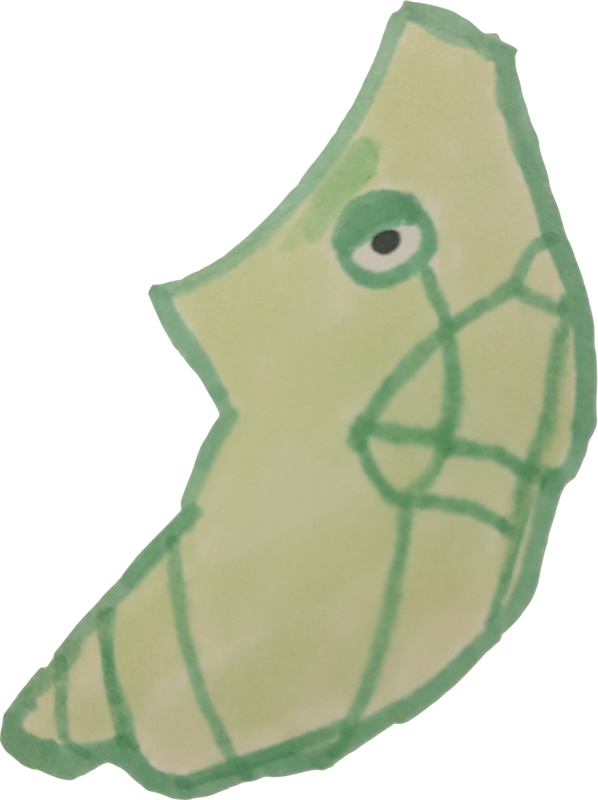

metapng hides something wonderful inside pngs



we can see what it knows...

```clojure
(:require [metapng.core :as metapng]))
(:name (metapng/get-metadata "meta.png"))
=> "metapod"
```

or perhaps write our own genesis when playing with quil...

```clojure
(metapng/bake "boring.png" "meta.png" {:code (slurp *file*)})
```

it can be caught on clojars

```clojure
[metapng "0.1.1"]
```

a more fruitful example, from an old [sketch][]

```clojure
(defn snapshot [state]
  "Save a png with the code and state in its metadata"
  (let [temp-filename "tmp.png"
        output-filename (str "calendar-" (q/frame-count) ".png")]
    (q/save temp-filename)
    (metapng/bake temp-filename output-filename {
       :code (slurp *file*)
       :state (str state)
       :author "Jonathan Dahan"
    })))
```

[sketch]: https://github.com/jedahan/calendar/blob/d4a451396da7ba7bac6c21674d190bc9e79d77d9/src/calendar/sketch.clj#L61-L70
